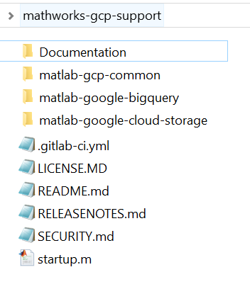

# Installation

## Installing on Windows®, macOS® and Linux
The easiest way to install this package and all required dependencies is to clone the top-level repository using:

```bash
git clone --recursive https://github.com/mathworks-ref-arch/mathworks-gcp-support.git
```
This is what your top level directory<sup>1</sup> should look like:


### Build the matlab-gcp-common SDK for Java components
The dependencies for the `MATLAB interface for Google BigQuery` and other similar connectors are accessed and built using the ```matlab-gcp-common``` as follows:
```bash
cd mathworks-gcp-support/matlab-gcp-common/Software/Java
mvn clean package
```
More details can be found here: [Build](Rebuild.md)

Once built, use the ```mathworks-gcp-support/matlab-google-bigquery/Software/MATLAB/startup.m``` function to initialize the interface.
```MATLAB
cd('mathworks-gcp-support/matlab-google-bigquery/Software/MATLAB')
startup
```
The package is now ready for use.

As a next step, please refer to [Authentication](Authentication.md)

## Notes:

<sup>1</sup> Used with permission from Microsoft.

[//]: #  (Copyright 2020 The MathWorks, Inc.)
