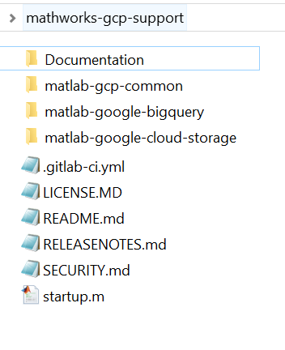

# MATLAB® Interface *for Google Cloud BigQuery™*

This is a MATLAB® interface for querying datasets using the Google Cloud BigQuery™ services.

## Requirements
### MathWorks products
* Requires MATLAB release R2018a or later.
* Install [Google Cloud Common](https://github.com/mathworks-ref-arch/matlab-gcp-common)

### 3rd party products
* Access to a Google Cloud Platform Services account

To build the Java SDK, install the following:   
* [Maven](https://maven.apache.org/)
* JDK 8

## Getting Started
Please refer to the [Documentation](Documentation/README.md) to get started.
The instructions for [Installation](Documentation/Installation.md) and [Getting Started](Documentation/GettingStarted.md) documents provide detailed steps for setting up and using this interface.

The easiest way to fetch this repo and all required dependencies, is to clone the top-level repository using:

```bash
git clone --recursive https://github.com/mathworks-ref-arch/mathworks-gcp-support.git
```

This is what your top level directory<sup>1</sup> should look like:




### Steps for setting up the google-cloud-bigquery SDK

The MATLAB connector for Google BigQuery uses a single JAVA SDK which can be built as follows:
```bash
cd mathworks-gcp-support/matlab-gcp-common/Software/Java
mvn clean package
```

Once the above SDK is built, use the ```mathworks-gcp-support/matlab-google-bigquery/Software/MATLAB/startup.m``` function to initialize the interface.
```MATLAB
cd('mathworks-gcp-support/matlab-google-bigquery/Software/MATLAB')
startup
```
Google service account credentials need to be downloaded. For obtaining credentials and ```setting up authentication``` refer [Authentication](Documentation/Authentication.md)

### Quickstart

This is a quickstart for using the interface to BigQuery. More detailed examples can be found in [BasicUsage](Documentation/BasicUsage.md)

```MATLAB
% Create a BigQuery client

gbq = gcp.bigquery.BigQuery();


gbq =

  BigQuery with properties:

    ProjectId: 'pfREDACTEDoy'
       Handle: [1x1 com.google.cloud.bigquery.BigQueryImpl]

% Create a query and set configurations for the query using a QueryJobConfiguration$Builder

query = "SELECT title, comment, contributor_ip, timestamp, num_characters FROM [publicdata:samples.wikipedia] WHERE wp_namespace = 0 LIMIT 400;";
queryJobConfigurationBuilder =  gcp.bigquery.QueryJobConfiguration.newBuilder(query);
queryJobConfigurationBuilder = queryJobConfigurationBuilder.setUseLegacySql(logical(1));

queryJobConfigurationBuilder =

  Builder with properties:

    Handle: [1x1 com.google.cloud.bigquery.QueryJobConfiguration$Builder]

% Build the queryJobConfiguration once all the configurations are set

queryJobConfiguration = queryJobConfigurationBuilder.build;

queryJobConfiguration =

  QueryJobConfiguration with properties:

    Handle: [1x1 com.google.cloud.bigquery.QueryJobConfiguration]

% Build a BigQuery job for making the query

% Job attributes of interest can be selected in the array of JobFields

jobField = gcp.bigquery.BigQuery.JobField.values;

jobField =

  JobField with properties:

    Handle: [8×1 com.google.cloud.bigquery.BigQuery$JobField[]]

% Job Options for the BigQuery Job
jobOptions = gcp.bigquery.BigQuery.JobOption.fields(jobField);

jobOptions =

  JobOption with properties:

    Handle: [1×1 com.google.cloud.bigquery.BigQuery$JobOption]

% Create a unique JobId

jobId = gcp.bigquery.JobId.of();

jobId =

  JobId with properties:

    ProjectId: 'pfREDACTEDoy'
       Handle: [1×1 com.google.cloud.bigquery.AutoValue_JobId]


% Use queryJobConfiguration and jobID as a part of JobInfo

jobInfoBuilder = gcp.bigquery.JobInfo.newBuilder(queryJobConfiguration);
jobInfoBuilder = jobInfoBuilder.setJobId(jobId);

jobInfoBuilder =

  Builder with properties:

    Handle: [1×1 com.google.cloud.bigquery.JobInfo$BuilderImpl]


jobInfo = jobInfoBuilder.build;

jobInfo =

  JobInfo with properties:

    Handle: [1×1 com.google.cloud.bigquery.JobInfo]

% Create a bigquery Job

job = gbq.create(jobInfo,jobOptions);

job =

  Job with properties:

    Handle: [1×1 com.google.cloud.bigquery.Job]

% Settings for receiving query results from the job can be set using QueryResultsOption

queryResultsOption = gcp.bigquery.BigQuery.QueryResultsOption.pageSize(100);

queryResultsOption =

  QueryResultsOption with properties:

    Handle: [1×1 com.google.cloud.bigquery.BigQuery$QueryResultsOption]

% Extract Query Results into a BigQuery TableResult object

tableResult = job.getQueryResults(queryResultsOption);

tableResult =

  TableResult with properties:

    Handle: [1x1 com.google.cloud.bigquery.TableResult]


% Extract results into a MATLAB table

resultTable = gbq2table(tableResult);

% preview the top rows

head(resultTable)

ans =

  8x5 table

                title                                                                                                                 comment                                                                                                      contributor_ip     timestamp     num_characters
    _____________________________    _________________________________________________________________________________________________________________________________________________________________________________________________________    ________________    __________    ______________

    "Varna"                          "/* Organized crime */"                                                                                                                                                                                      "216.254.71.25"     1.1763e+09           38617  
    "Carl Phillips"                  "/* Works */"                                                                                                                                                                                                "67.120.85.133"     1.1601e+09            2535  
    "Queen (band)"                   "/* Documentary */"                                                                                                                                                                                          "195.93.21.98"      1.1359e+09           44438  
    "List of rock instrumentals"     "/* Walter Giardino */"                                                                                                                                                                                      "200.45.16.104"     1.2276e+09      1.8945e+05  
    "Luis Eduardo Aute"              "/* References */"                                                                                                                                                                                           "112.201.183.85"     1.263e+09            5719  
    "Short circuit"                  "edit"                                                                                                                                                                                                       "170.170.59.138"    1.2581e+09            7652  
    "Alexandroupoli"                 "The reason for removal is that there is absolutely no reason to add the Turkish name. If so we should ass Korean, German, etc names also. Adding Turkish names,especially at the start gives wrong impr"    "87.202.148.235"    1.1783e+09            8102  
    "Order of the Holy Sepulchre"    "/* Grand Master of the Order */"                                                                                                                                                                            "66.82.9.99"        1.2205e+09           13713  


```

For an end to end example refer ```Software/MATLAB/script/Examples```

## Logging
When getting started or debugging it can be helpful to get more feedback. Once the client has been created one can set the logging level to verbose as follows:
```
logObj = Logger.getLogger();
logObj.DisplayLevel = 'verbose';
```
See: [Logging](Documentation/Logging.md) for more details.

## License
The license for the MATLAB Interface *for Google BigQuery* is available in the [LICENSE.md](LICENSE.md) file in this GitHub repository. This package uses certain third-party content which is licensed under separate license agreements. See the [pom.xml](https://github.com/mathworks-ref-arch/matlab-gcp-common/blob/master/Software/Java/pom.xml)

## Enhancement Request
Provide suggestions for additional features or capabilities using the following link:   
https://www.mathworks.com/products/reference-architectures/request-new-reference-architectures.html

## Support
Email: `mwlab@mathworks.com` or please log an issue.

## Notes:

<sup>1</sup> Used with permission from Microsoft.     

[//]: #  (Copyright 2020 The MathWorks, Inc.)
